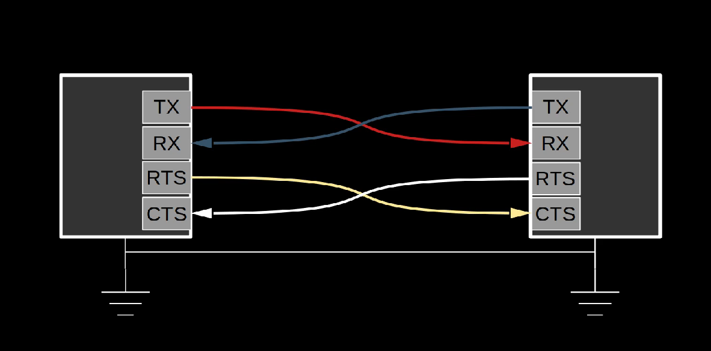

# xmodem_transfer_example

## About
This example demonstrates file transfer using XMODEM protocol via UART.

## Prerequisite
* Hardware
    * 2 Computers with a UART enabled - whatever computers with UART such as Raspberry Pi with an UART enabled or x86 PC with USB-UART bridge
      * TXD, RXD
      * RTS & CTS should be enabled for hardware flow control.
    
    
    
* Software
    * Python3: Tested with 3.10 and 3.11
    * pyserial: Tested with 3.5
    * xmodem: Tested with 0.4.6 and 0.4.7

## Contents

- serial_tx.py
  - An example of sending data via a serial port using the pyserial module.
- serial_rx.py
  - An example of receiving data via a serial port using the pyserial module.
- xmodem_send.py
  - An example of file transmission using XMODEM.
- xmodem_receive.py
  - An example of receiving a file using XMODEM.
- xmodem_transfer.py
  - An example implementation of a file transfer application using the pyserial and xmodem modules.

## How to run

Clone the repository.
```bash
# You can bypass follow 2 commands if you already have cloned.
git clone https://github.com/sangyoungn/play_with_RPi.git
cd xmodem_transfer_example
```
Run the script.
```bash
# On trasnmitting computer
python xmodem_transfer.py -m T -p /dev/ttyUSB0 -f source/file/to/transfer

# On receiving computer
python xmodem_transfer.py -m R -p /dev/ttyAMA2 -f filename/to/save

# For usage instruction
python xmodem_transfer.py -h
```